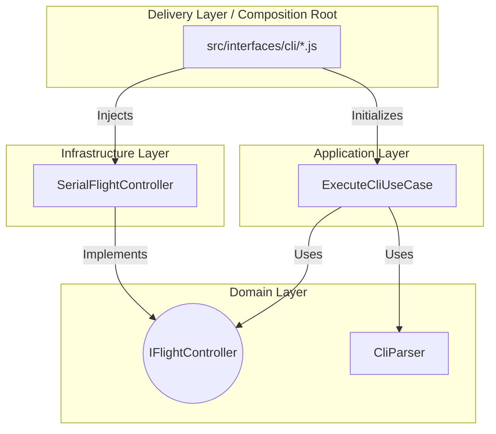
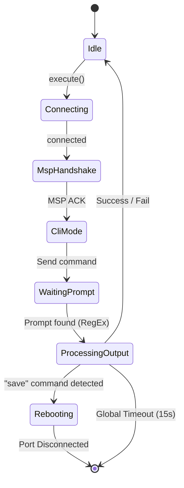
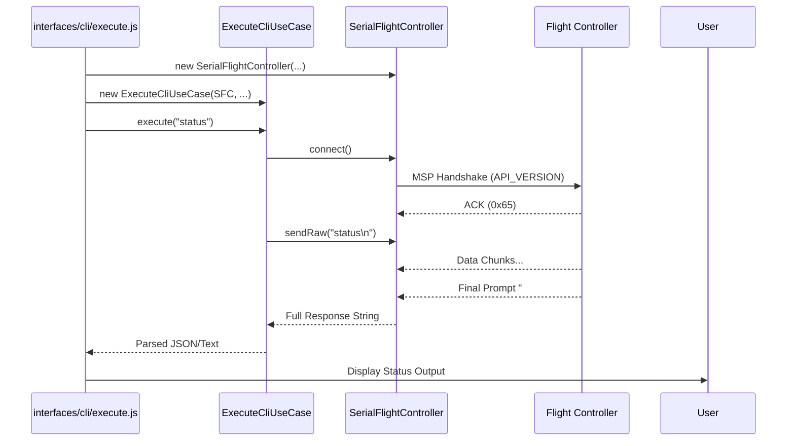
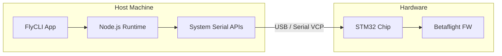

# FlyCLI Solution Architecture

This document describes the architectural solution of FlyCLI using **C4 Model** and **4+1 Architectural View Model** practices. The project is designed as a High-Stability tool for automated diagnostics and configuration of Betaflight flight controllers.

---

## 1. System Context (C4 Level 1)
FlyCLI acts as a mediator between the AI/Pilot and the hardware (Flight Controller).

---

## 2. Logical View (Clean Architecture)
We use hexagonal architecture (Ports and Adapters) to ensure business logic independence.

### Layers:
- **Domain Layer**: Entities and interfaces (`IFlightController`, `CliParser`).
- **Application Layer**: Use Cases that implement specific business scenarios (`ExecuteCliUseCase`).
- **Infrastructure Layer**: Implementation of Serial communication and Port Scanning.
- **Delivery Layer (Composition Root)**: CLI interface in `src/interfaces/cli/`. This is the only place where infrastructure connects with the application (Dependency Injection).

---

## 3. State Machine (Command Lifecycle)
The CLI command execution process passes through several states to guarantee stability and avoid port "hanging".

---

## 4. Process View (Hardware Interaction)
FlyCLI implements resilient processing of asynchronous events and fragmented data.

---

## 5. Development View (Standards & Tools)
The project adheres to high code quality principles to ensure AI-Ready status.

- **Linting**: Airbnb JavaScript Style Guide (Strict).
- **Module System**: ESM (ECMAScript Modules).
- **Testing Strategy**:
    - **Unit (Jest)**: Covers all significant behavior branches, including timeouts and connection breaks.
    - **Integration (Jest)**: Control of architectural layers through **dependency-cruiser**.
    - **BDD (Cucumber)**: **34 scenarios** of full functional verification on real hardware (STM32F411).
- **Resilience**: Protected by timeouts and buffer flush mechanisms.

---

## 6. Physical View (Deployment)
FlyCLI is deployed as a Node.js tool connected via USB.

---

## 7. Implementation Reality (Bottom-Up Challenges)

### 7.1. Data Fragmentation (Serial Chunks)
The reality of working with USB-VCP requires processing chunks of 64/128 bytes. `SerialFlightController` accumulates data in `#buffer` until the prompt pattern appears.

### 7.2. Debounce (Fake Prompts)
A delay of **300ms** is added in `ExecuteCliUseCase` after prompt detection to collect the "tail" of data that might have been delayed in the buffer.

### 7.3. Hardware Handshake
MSP Handshake at start forces the firmware to initialize the USB stack, which is critical for reliable entry into CLI mode on some boards (e.g., STM32F411 Black Pill).

---

## Key Design Decisions (ADR Summary)
- **Prompt Detection**: Dynamic detection via RegEx.
- **Echo Suppression**: Command echo removal.
- **Strict ESM**: Pure JS without a transpilation stage.
