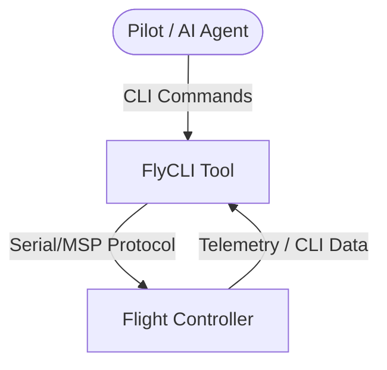
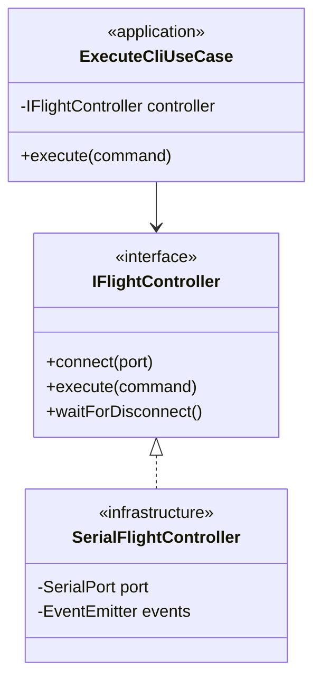
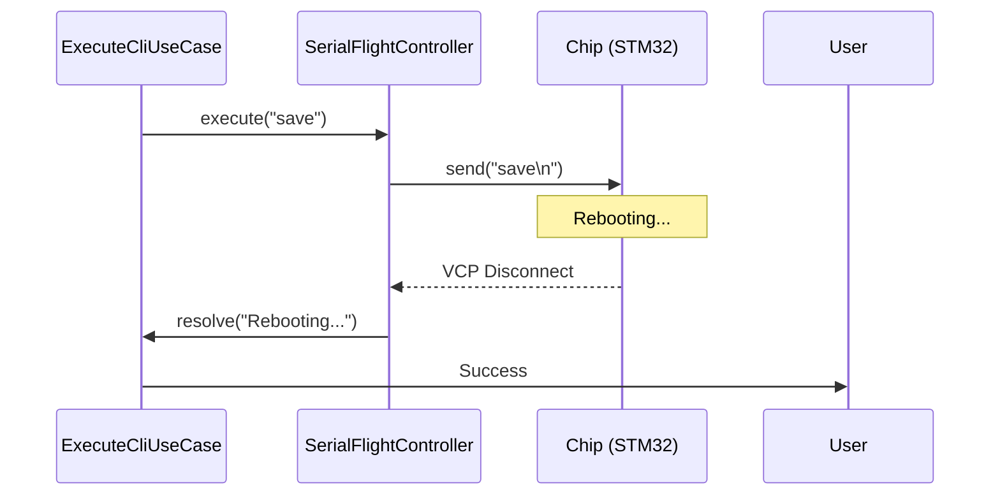

# FlyCLI Solution Architecture

Цей документ описує архітектурне рішення FlyCLI з використанням практик **C4 Model** та **4+1 Architectural View Model**. Проєкт розроблений як High-Stability інструмент для автоматизованої діагностики та конфігурації польотних контролерів Betaflight.

---

## 1. System Context (C4 Level 1)
FlyCLI виступає посередником між AI/Pilot та апаратною частиною (Flight Controller). 



---

## 2. Logical View (Clean Architecture)
Ми використовуємо гексагональну архітектуру (Ports and Adapters) для забезпечення незалежності бізнес-логіки від особливостей реалізації послідовного порту.



### Рівні (Layers):
- **Domain Layer**: Сутності та інтерфейси (`IFlightController`, `CliParser`).
- **Application Layer**: Use Cases, що реалізують конкретні бізнес-сценарії (`ExecuteCliUseCase`, `GetHealthCheckUseCase`).
- **Infrastructure Layer**: Реалізація Serial-зв'язку та Port Scanning.
- **Delivery Layer**: CLI інтерфейс (Commander.js).

---

## 3. Process View (Hardware Interaction)
Особлива увага приділена стабільності при роботі з залізом. FlyCLI реалізує стійку обробку асинхронних подій.

### Сценарій "Execute Command & Reboot":
Коли надсилається команда `save`, FlyCLI переходить у режим очікування розриву з'єднання (VCP disconnect), що є критичним для STM32-базованих систем.



---

## 4. Development View (Standards & Tools)
Проєкт дотримується принципів високої якості коду, що робить його AI-Ready та легким для підтримки.

- **Linting**: Airbnb JavaScript Style Guide (Strict).
- **Module System**: ESM (ECMAScript Modules).
- **Testing Strategy**:
    - **Unit (Jest)**: 100% покриття бізнес-логіки Use Case за допомогою моків. Тести знаходяться в `test/unit/`.
    - **Integration (Jest)**: Технічна верифікація інфраструктури (стабільність з'єднання, архітектурні правила). Тести в `test/integration/`.
    - **BDD (Cucumber)**: Реальна поведінкова верифікація на апаратному чіпі (STM32F411). Тести в `test/bdd/` — це основний доказ працездатності для кінцевого користувача.
- **Safety**: Кожна операція захищена таймаутами та механізмами очищення буферів (flush).

---

## 5. Physical View (Deployment)
FlyCLI розгортається як Node.js інструмент на хост-машині, що з'єднана з Flight Controller через USB-кабель (COM/TTY Port).

```mermaid
deployment
    node HostMachine [Host Machine (macOS/Linux)] {
        instance FlyCLI_App [Node.js Runtime]
    }
    node FlightController [STM32 Flight Controller] {
        instance Betaflight [Betaflight Firmware]
    }
    HostMachine -- "USB (Serial VCP)" --> FlightController
```

---

## Key Design Decisions (ADR Summary)
- **Prompt Detection**: Використання регулярних виразів для детекції `#` або `CLI` банера замість фіксованих пауз.
- **Echo Suppression**: Автоматичне видалення відлуння команди з результатів парсингу для чистоти даних.
- **Resilient Parsing**: `CliParser` пріоритезує заголовки таблиць, що дозволяє AI коректно розпізнавати стани сенсорів та задач.
