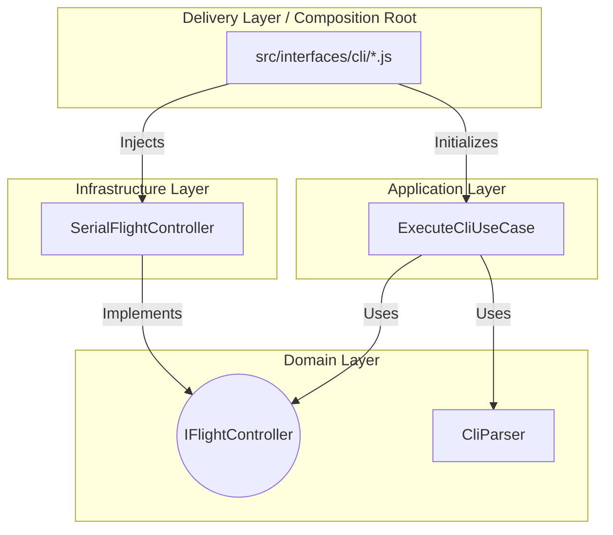
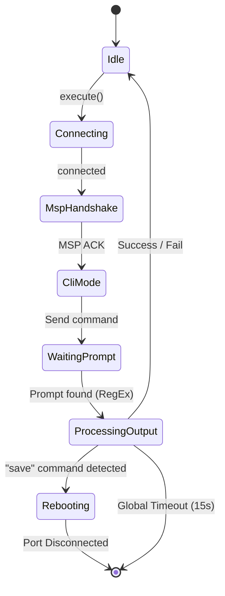
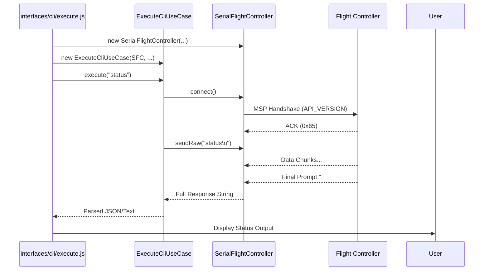
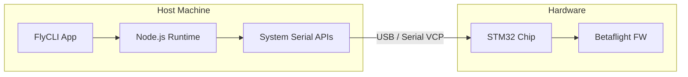

# FlyCLI Solution Architecture

Цей документ описує архітектурне рішення FlyCLI з використанням практик **C4 Model** та **4+1 Architectural View Model**. Проєкт розроблений як High-Stability інструмент для автоматизованої діагностики та конфігурації польотних контролерів Betaflight.

---

## 1. System Context (C4 Level 1)
FlyCLI виступає посередником між AI/Pilot та апаратною частиною (Flight Controller). 

---

## 2. Logical View (Clean Architecture)
Ми використовуємо гексагональну архітектуру (Ports and Adapters) для забезпечення незалежності бізнес-логіки.

### Рівні (Layers):
- **Domain Layer**: Сутності та інтерфейси (`IFlightController`, `CliParser`).
- **Application Layer**: Use Cases, що реалізують конкретні бізнес-сценарії (`ExecuteCliUseCase`).
- **Infrastructure Layer**: Реалізація Serial-зв'язку та Port Scanning.
- **Delivery Layer (Composition Root)**: CLI інтерфейс у `src/interfaces/cli/`. Це єдине місце, де інфраструктура з'єднується з додатком (Dependency Injection).

---

## 3. State Machine (Command Lifecycle)
Процес виконання команди CLI проходить через кілька станів для гарантування стабільності та уникнення "висання" порту.

---

## 4. Process View (Hardware Interaction)
FlyCLI реалізує стійку обробку асинхронних подій та фрагментованих даних.

---

## 5. Development View (Standards & Tools)
Проєкт дотримується принципів високої якості коду для забезпечення AI-Ready статусу.

- **Linting**: Airbnb JavaScript Style Guide (Strict).
- **Module System**: ESM (ECMAScript Modules).
- **Testing Strategy**:
    - **Unit (Jest)**: Покриває всі значущі гілки поведінки, включаючи таймаути та розриви з'єднання.
    - **Integration (Jest)**: Контроль архітектурних шарів через **dependency-cruiser**.
    - **BDD (Cucumber)**: **34 сценарії** повної функціональної верифікації на реальному залізі (STM32F411).
- **Resilience**: захист таймаутами та механізмами очищення буферів (flush).

---

## 6. Physical View (Deployment)
FlyCLI розгортається як Node.js інструмент, що з'єднаний через USB.

---

## 7. Implementation Reality (Bottom-Up Challenges)

### 7.1. Фрагментація даних (Serial Chunks)
Реальність роботи з USB-VCP вимагає обробки чанків по 64/128 байт. `SerialFlightController` накопичує дані в `#buffer` до появи паттерну промпта.

### 7.2. Дебаунс (Fake Prompts)
В `ExecuteCliUseCase` додано затримку **300мс** після детекції промпта для збору "хвоста" даних, які могли затриматися в буфері.

### 7.3. Hardware Handshake
MSP Handshake при старті змушує прошивку ініціалізувати USB-стек, що критично для надійного входу в CLI режим на деяких платах (наприклад, STM32F411 Black Pill).

---

## Key Design Decisions (ADR Summary)
- **Prompt Detection**: Динамічна детекція через RegEx.
- **Echo Suppression**: Видалення відлуння команди.
- **Strict ESM**: Чистий JS без етапу транспайляції.
