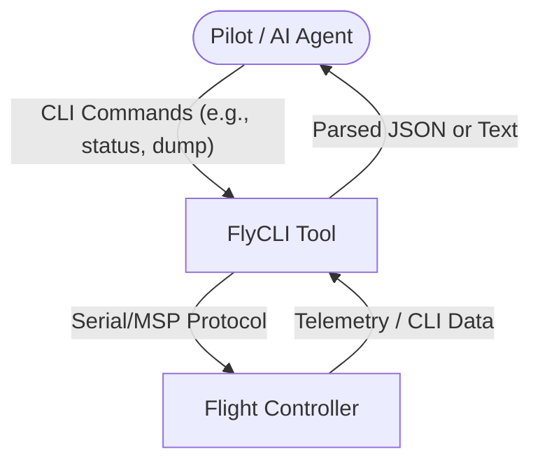
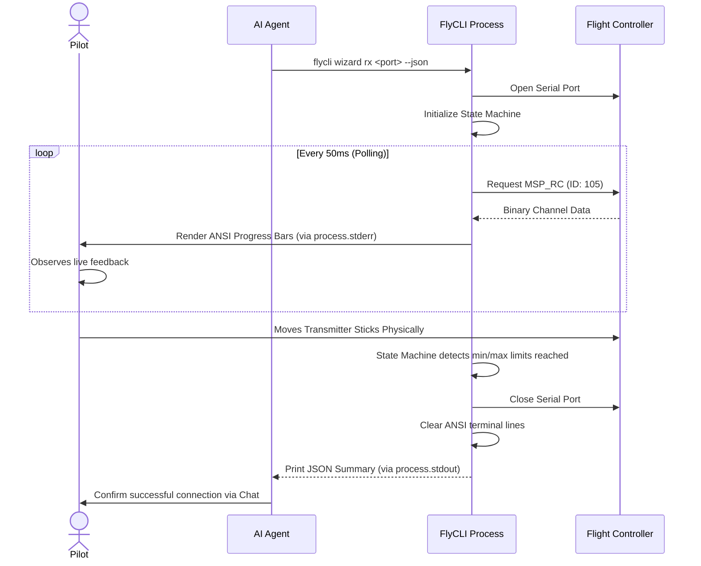

# 1. Scenarios View (+1 View)

## Context
This view illustrates how the FlyCLI system is used from the perspective of external actors (Human Pilots and AI Agents) interacting with the Flight Controller hardware.

## 1.1 Core CLI Execution Scenario (Global)
This represents the primary use case: sending atomic text commands and retrieving structured results.

## 1.2 Interactive RC Calibration Scenario (New Feature)
This flow highlights orchestration: the AI Agent triggers an interactive command, but the Human provides the physical input. FlyCLI acts as the bridge, providing visual feedback to the Human while collecting structured data for the Agent.

