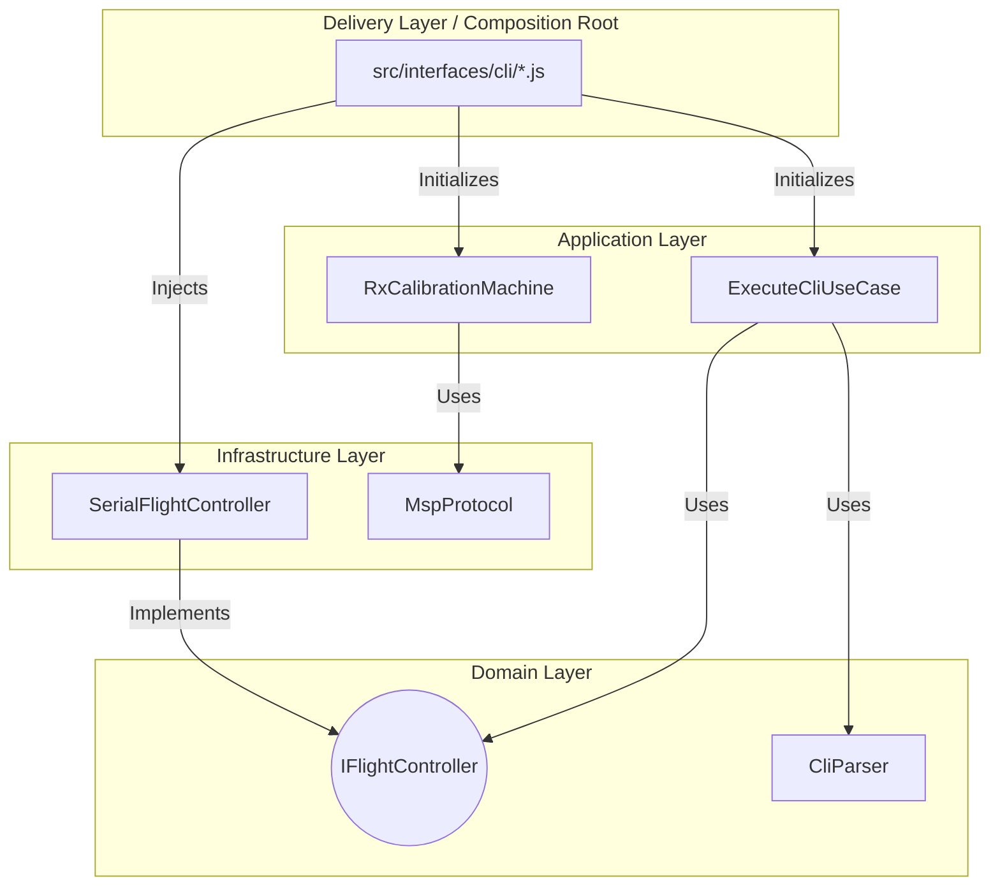
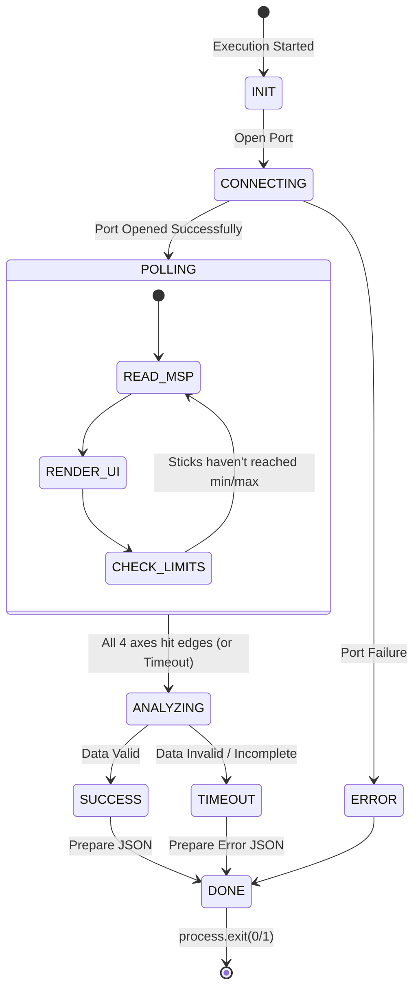

# 2. Logical View

## Context
This view outlines the primary abstractions, components, and the clean architecture that drives the business logic of FlyCLI. We use hexagonal architecture (Ports and Adapters) to ensure business logic independence.

## 2.1 Hexagonal Architecture (Global System)

### Layers:
- **Domain Layer**: Entities and interfaces (`IFlightController`, `CliParser`).
- **Application Layer**: Use Cases that implement specific scenarios (`ExecuteCliUseCase`, `RxCalibrationMachine`).
- **Infrastructure Layer**: Implementation of Serial communication (`SerialFlightController`) and binary protocol parsing (`MspProtocol`).
- **Delivery Layer**: CLI interfaces in `src/interfaces/cli/`. This is the only place where infrastructure connects with the application.

## 2.2 Interactive RC State Machine (Feature Logic)
The `RxCalibrationMachine` governs the RC wizard lifecycle.

