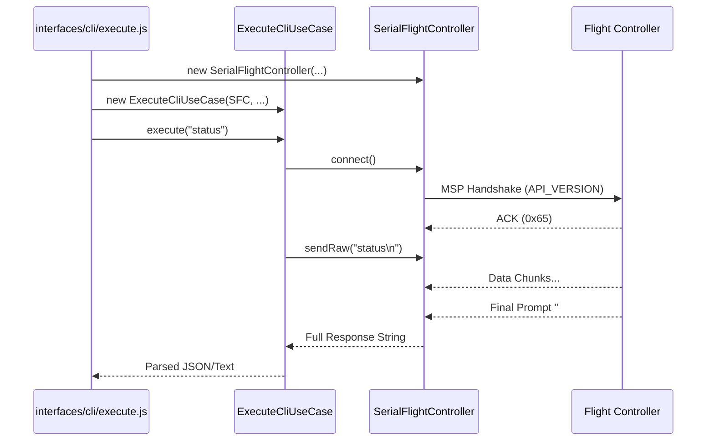
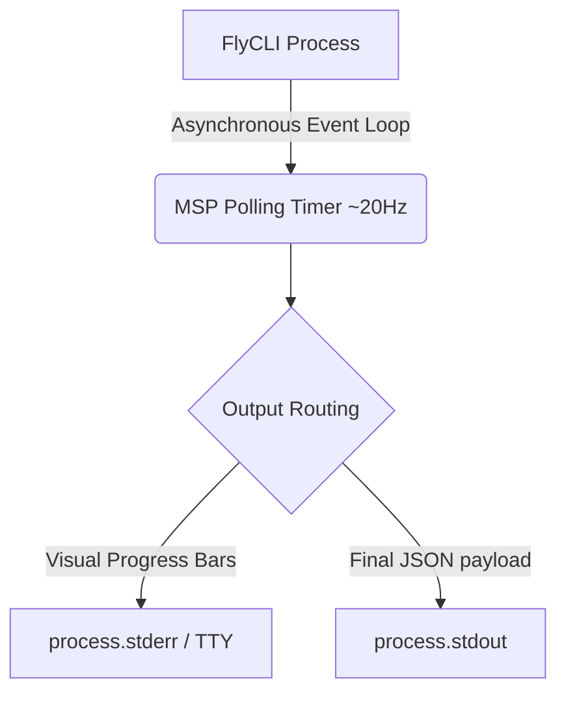

# 3. Process View

## Context
This view explains the flow of data across asynchronous processes, focusing on hardware communication resilience and output stream separation.

## 3.1 Hardware Interaction (Command Lifecycle)
FlyCLI implements resilient processing of asynchronous events and fragmented data.

### Implementation Realities:
- **Data Fragmentation:** USB-VCP requires processing chunks of 64/128 bytes. `SerialFlightController` accumulates data in `#buffer` until the prompt pattern appears.
- **Debounce:** A delay of **300ms** is added in `ExecuteCliUseCase` after prompt detection to collect the "tail" of data.

## 3.2 Data Stream Separation (Interactive UI)
For interactive features (like the RC Wizard), visual elements must not corrupt machine-readable output formats.

- `process.stderr.write` is used synchronously to draw ANSI bars.
- `console.log` (stdout) is strictly reserved for the final output string/JSON.
