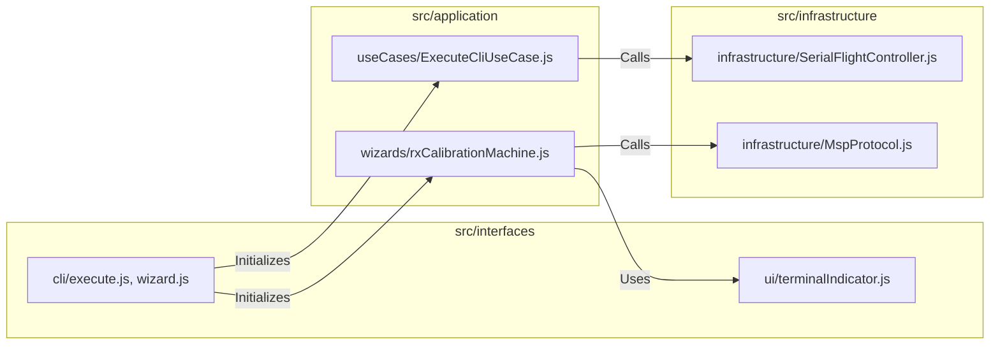

# 4. Development View

## Context
This view outlines the project's development standards, directory structures, and quality assurance strategies.

## 4.1 Standards & Tools
The project adheres to high code quality principles to ensure AI-Ready status.
- **Linting**: Airbnb JavaScript Style Guide (Strict).
- **Module System**: ESM (ECMAScript Modules) without transpilation.
- **Testing Strategy**:
    - **Unit (Jest)**: Covers all significant behavior branches, including timeouts and connection breaks.
    - **Integration (Jest)**: Control of architectural layers through **dependency-cruiser**.
    - **BDD (Cucumber)**: **34 scenarios** of full functional verification on real hardware (STM32F411).

## 4.2 Module Organization

## 4.3 Key Design Decisions
- **Prompt Detection**: Dynamic detection via RegEx.
- **Echo Suppression**: Command echo removal during CLI parsing.
- **AI-First Design**: `--json` output support and strictly separated streams (stderr for UI, stdout for data) ensure LLM Agents don't hallucinate over visual artifacts.
